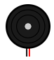
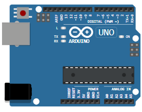

# Buzzer y Bipolar Stepper Motor

## SPBB22-Exposición de 2 sensores con el simulador de CirtuitPython

### Esta es una presentación de la materia de Sistemas Programables
En este apartado hicimos uso de los siguientes recursos:

- 🔭 Una pieza Buzzer
- 🖥 Un Stepper Motor
- 📲 Un Arduino UNO
- 🤔 Simulador de CircuitPython
- 💬 Uso de Generador de Tablas
- 📫 Uso de Cool Text
- 😄 Uso de GitHub Pages
- ⚡ Uso de la documentación

## ¿Que es un Buzzer?
### Un zumbador piezoeléctrico

### Nombre de Pines
| Nombre |        Descripción       |
|:------:|:------------------------:|
| 1      | Clavija negativa (negra) |
| 2      | Clavija positiva (roja)  |

### Atributos
|  Nombre |                        Descripción                       | Valor por defecto |
|:-------:|:--------------------------------------------------------:|:-----------------:|
| modo    | Modo de funcionamiento del zumbador: "suave" o "preciso" | "suave"           |
| volumen | Volumen (sonoridad) del sonido, entre "0.01" y "1.0"     | "1.0"             |

### Modos de Operación
El zumbador puede funcionar en dos modos: "suave" (predeterminado) y "preciso".

"suave" suena mejor y es adecuado para tonos simples de una sola frecuencia. Úselo cuando toque una melodía o toque tonos con la tone()vfunción de Arduino. Es posible que los sonidos complejos y polifónicos no se reproduzcan correctamente (o no se reproduzcan en absoluto) en el "modo suave"

Utilice el modo "preciso" cuando necesite reproducir sonidos complejos. Reproducirá con precisión el sonido que ingrese. Sin embargo, agregará ruidos de clic audibles a su sonido. Estos ruidos se deben a fluctuaciones en la velocidad de la simulación; no siempre es posible proporcionar el búfer de sonido completo en tiempo real.

### Ejemplo de Arduino
Conecte el pin 1 del zumbador al pin Arduino GND y el pin 2 del zumbador al pin 8 de Arduino. Luego use la tone() función para reproducir un sonido:

Simon game - Un juego de memoria con 4 pulsadores

## ¿Que es un Stepper Motor?
### Un motor paso a paso bipolar

### Nombre de Pines
| Nombre |       Descripción       |
|:------:|:-----------------------:|
| A-     | Bobina A señal negativa |
| A+     | Bobina A señal positiva |
| B+     | Bobina B señal positiva |
| B-     | Bobina B señal negativa |

### Atributos
|          Nombre         |                                                         Descripción                                                         | Valor por defecto |
|:-----------------------:|:---------------------------------------------------------------------------------------------------------------------------:|:-----------------:|
| flecha                  | Muestra una flecha para indicar la posición del paso a paso. Establecer en el color de la flecha, por ejemplo, "naranja"    | ""                |
| monitor                 | ¿Qué número mostrar en el paso a paso? Valores válidos "pasos", "ángulo" (en grados), "ninguno"                             | "pasos"           |
| relación de transmisión | La relación de transmisión del motor. configúrelo en "1:1" para 200 pasos/revolución, "2:1" para 400 pasos/revolución, etc. | "1:1"             |

### Usando el motor
Cuando usa un motor paso a paso, necesita un chip controlador que pueda suministrar grandes cantidades de corriente a las bobinas del motor. Wokwi es compatible con la placa de controlador común A4988 . También puede conectar el motor paso a paso directamente a su microcontrolador. Wokwi utiliza un motor de simulación digital, por lo que no se tiene en cuenta la corriente de la bobina.

Puede usar una variedad de bibliotecas Arduino para controlar el motor paso a paso: Stepper, AccelStepper, etc.

### Comportamiento en la simulación
El motor paso a paso se mueve 1,8 grados por paso (200 pasos por revolución). El motor también admite medios pasos (0,9 grados por paso/400 pasos por revolución). Incluso puede usar micropasos más pequeños (por ejemplo, 1/4 o 1/8 de paso), pero el motor simulado solo muestra el ángulo con una resolución de medio paso. Para obtener más información, consulte la tabla de configuración de micropasos A4988 .

### Ejemplo de Arduino

Motor paso a paso utilizando la biblioteca Arduino Stepper
